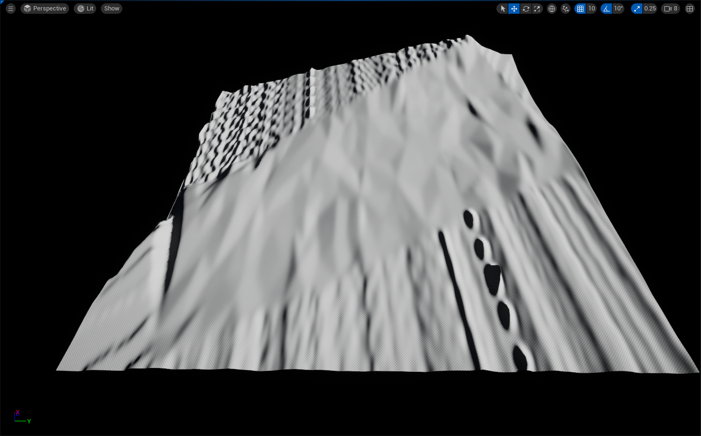
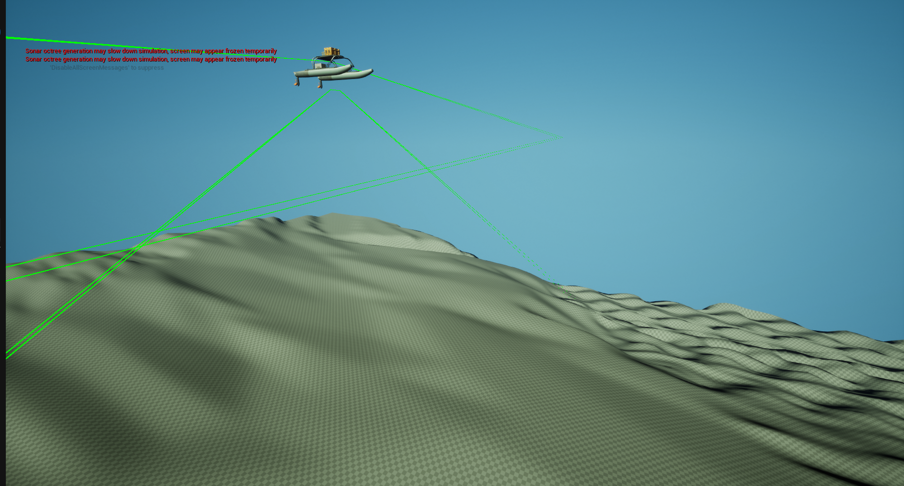
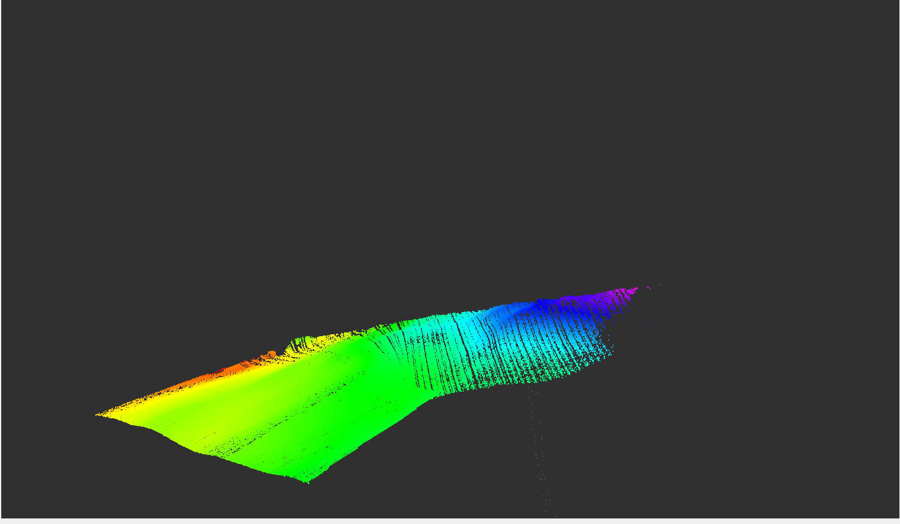
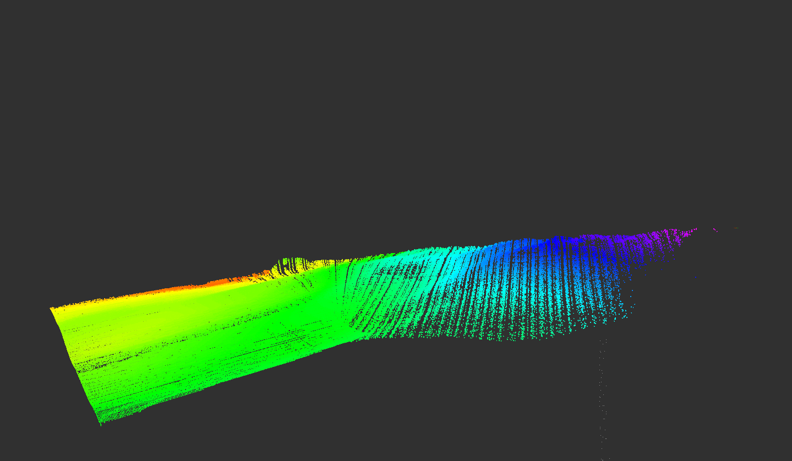

# HoloOcean ROS2 Bridge (ASV Mapping Simulator)

## Please install HoloOcean v2.3.0 First

Holoocean Docs: [Holoocean Docs](https://byu-holoocean.github.io/holoocean-docs/v2.3.0/index.html)

Then install the environment:

[Holoocean Environment](https://drive.google.com/drive/folders/1G0KdRZkOSUPKUMqNDETGJBVFilPJqJce?usp=sharing)


Copy environment file to : .**local/share/holoocean/2.3.0/worlds/**


## Sonar Data Based Map




## Mapping Output





## 🛠️ Technical Documentation

### Architecture Overview

```text
HoloOcean (Python)
  └── SurfaceVessel agent
        ├── ProfilingSonar  ──► /holoocean/sonar/points  [sensor_msgs/PointCloud2]
        │                   ──► /holoocean/sonar/image   [sensor_msgs/Image]
        ├── IMUSensor       ──► /holoocean/imu           [sensor_msgs/Imu]
        ├── GPSSensor       ──► /holoocean/gps           [sensor_msgs/NavSatFix]
        ├── DVLSensor       ──► /holoocean/dvl/velocity  [geometry_msgs/TwistStamped]
        └── PoseSensor      ──► /holoocean/odom          [nav_msgs/Odometry]
                            ──► /holoocean/pose          [geometry_msgs/PoseStamped]
                            ──► /holoocean/vessel_marker [visualization_msgs/Marker]
                            ──► TF: world → base_link

ROS2 ──► /holoocean/cmd_vel  [geometry_msgs/Twist]  ──► SurfaceVessel thrusters
```

### Features

- **Autonomous mode**: Built-in autonomous path pattern (forward → left → backward → right)
- **Web Dashboard**: Modern HTML5 interface with ROS2 live plots, controls, and telemetry (requires `rosbridge_server`)
- **Realistic Vessel Physics**: Integrates Thor I. Fossen's 3-DOF non-linear maneuvering equations
- **Sonar visualization**: PointCloud2 in vessel-relative frame (base_link)
- **Vessel markers**: RViz visualization with cube + arrow showing position/heading
- **Multiple sensors**: IMU, GPS, DVL, Pose, Sidescan Waterfall all bridged to ROS2
- **Performance Optimized**: Configured specifically to maintain framerates during heavy PointCloud mapping calculations.

---

### Prerequisites

#### 1. Ubuntu 22.04 + ROS2 Humble
```bash
sudo apt install ros-humble-desktop python3-colcon-common-extensions
```

#### 2. HoloOcean v2.3.0
```bash
pip install holoocean==2.3.0
python -c "import holoocean; holoocean.install('Ocean')"
```

#### 3. ROS2 Python dependencies
```bash
sudo apt install \
  ros-humble-tf2-ros \
  ros-humble-sensor-msgs \
  ros-humble-nav-msgs \
  ros-humble-geometry-msgs \
  ros-humble-visualization-msgs
```

---

### Build & Install

```bash
# 1. Create workspace
mkdir -p ~/ros2_ws/src
cd ~/ros2_ws/src

# 2. Clone or copy the package
git clone https://github.com/YOUR_USERNAME/holoocean_ros2_bridge.git

# 3. Build
cd ~/ros2_ws
source /opt/ros/humble/setup.bash
colcon build --packages-select holoocean_ros2_bridge
source install/setup.bash
```

---

### Running

#### Launch Options

```bash
source ~/ros2_ws/install/setup.bash

# Basic launch (manual terminal control)
ros2 launch holoocean_ros2_bridge bridge.launch.py

# With autonomous movement (forward 5s → left 5s → backward 5s → right 5s)
ros2 launch holoocean_ros2_bridge bridge.launch.py auto_mode:=true

# With custom scenario file
ros2 launch holoocean_ros2_bridge bridge.launch.py \
    scenario_file:=/path/to/my_scenario.json
```

#### Launching the Web Dashboard (Recommended)

To launch the web-based control dashboard, you must run `rosbridge_server` in the background.

```bash
# Terminal 1: Start the ROS2 WebSocket Bridge
ros2 launch rosbridge_server rosbridge_websocket_launch.xml

# Terminal 2: Launch the simulator and the Dashboard Server
ros2 launch holoocean_ros2_bridge bridge.launch.py use_dashboard:=true auto_mode:=false
```

Once both are running, open your browser to **http://localhost:8080/asv_dashboard.html**. From the dashboard, you can drive the vessel with `W/A/S/D` or the on-screen buttons, while tracking its route and real-time Fossen dynamics telemetry!

#### Launch Arguments

| Argument | Default | Description |
|----------|---------|-------------|
| `scenario_file` | `config/surface_mapping_scenario.json` | Path to HoloOcean scenario JSON |
| `auto_mode` | `true` | Enable autonomous movement pattern |
| `use_dashboard` | `false` | Launch the web dashboard server on port 8080 |
| `use_teleop` | `false` | Launch old keyboard teleop node |
| `fossen_surge_gain`| `50.0` | Thrust multiplier for forward/backward movement |
| `fossen_yaw_gain` | `20.0` | Thrust multiplier for vessel rotation |

#### Keyboard Teleop

```bash
# Launch with teleop enabled
ros2 launch holoocean_ros2_bridge bridge.launch.py use_teleop:=true auto_mode:=false

# Or run teleop separately in another terminal
ros2 run holoocean_ros2_bridge vessel_teleop
```

**Controls:**
- `w` / `s` - Forward / backward (hold to move)
- `a` / `d` - Turn left / right (hold to turn)
- `SPACE` - Emergency stop
- `q` - Quit

Hold multiple keys to combine motions (e.g. `w`+`a` for forward + left turn).

---

### Topics

| Topic | Type | Frame | Description |
|-------|------|-------|-------------|
| `/holoocean/sonar/points` | `sensor_msgs/PointCloud2` | `base_link` | Sonar points (relative to vessel) |
| `/holoocean/sonar/image` | `sensor_msgs/Image` | `base_link` | Raw sonar intensity |
| `/holoocean/imu` | `sensor_msgs/Imu` | `imu_link` | IMU data |
| `/holoocean/gps` | `sensor_msgs/NavSatFix` | `gps_link` | GPS coordinates |
| `/holoocean/dvl/velocity` | `geometry_msgs/TwistStamped` | `base_link` | DVL velocity |
| `/holoocean/odom` | `nav_msgs/Odometry` | `world` | Ground truth pose |
| `/holoocean/pose` | `geometry_msgs/PoseStamped` | `world` | Ground truth pose |
| `/holoocean/vessel_marker` | `visualization_msgs/Marker` | `base_link` | Vessel visual |

#### PointCloud2 Format

| Field | Type | Description |
|-------|------|-------------|
| `x` | float32 | Across-track (starboard positive) |
| `y` | float32 | Along-track (forward positive) |
| `z` | float32 | Depth (negative = below vessel in ENU) |
| `intensity` | float32 | Sonar return intensity 0–1 |

---

### RViz Visualization

```bash
# Launch with RViz
ros2 launch holoocean_ros2_bridge bridge.launch.py use_rviz:=true

# Or run RViz separately
rviz2 -d ~/ros2_ws/src/holoocean_ros2_bridge/rviz/mapping.rviz
```

The RViz config sets:
- Fixed frame: `base_link`
- Grid on XZ plane
- Sonar PointCloud with intensity coloring
- Vessel markers (cube + arrow)

---

### Configuration

Edit `config/surface_mapping_scenario.json` to change the environmental setup and optimize the sensors. We heavily tune `octree_min` and `octree_max`, along with `InitOctreeRange` to ensure real-time rendering. Example:

```json
{
    "name": "SurfaceVessel-Mapping",
    "world": "SimpleUnderwater",
    "ticks_per_sec": 30,
    "octree_min": 0.5,
    "octree_max": 5.0,
    "agents": [{
        "agent_type": "SurfaceVessel",
        "location": [25.0, 0.0, -1.0],
        ...
    }]
}
```

---

### Mapping Tools

#### OctoMap
```bash
sudo apt install ros-humble-octomap-server ros-humble-octomap-rviz-plugins
ros2 run octomap_server octomap_server_node \
    --ros-args \
    -p frame_id:=world \
    -p base_frame_id:=base_link \
    -p resolution:=0.5 \
    -p point_cloud_min_z:=-3000.0 \
    -p occupancy_min_z:=-3000.0 \
    -p sensor_model.max_range:=-1.0 \
    -r cloud_in:=/holoocean/sonar/points
```

#### RTABMap
```bash
sudo apt install ros-humble-rtabmap-ros
ros2 launch rtabmap_ros rtabmap.launch.py \
    subscribe_depth:=false \
    subscribe_scan_cloud:=true \
    scan_cloud_topic:=/holoocean/sonar/points \
    odom_topic:=/holoocean/odom \
    frame_id:=base_link
```

#### ROS Bag
```bash
ros2 bag record /holoocean/sonar/points /holoocean/odom /holoocean/gps
ros2 bag play <bag_folder>
```

---

### Troubleshooting

**HoloOcean env fails to start:**
```bash
python -c "import holoocean; print(holoocean.__version__)"
python -c "import holoocean; holoocean.install('Ocean')"
```

**Vessel not moving:**
- Check `thrust_scale` parameter (default 50.0)
- Use `auto_mode:=true` to test autonomous movement

**No sonar points:**
- Vessel must be underwater (z < 0)
- Check `sonar_intensity_threshold` (try 0.01)

**TF errors in RViz:**
- Ensure launch is running
- Check `ros2 run tf2_tools view_frames`